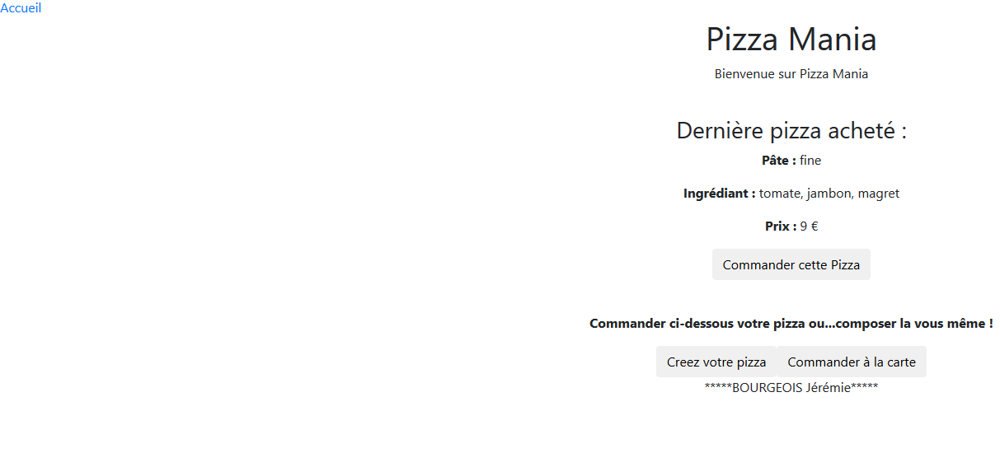
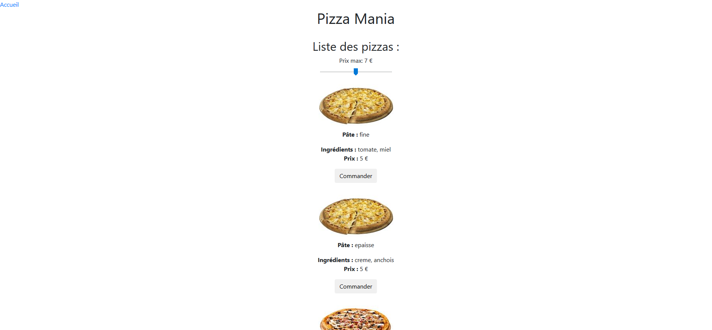
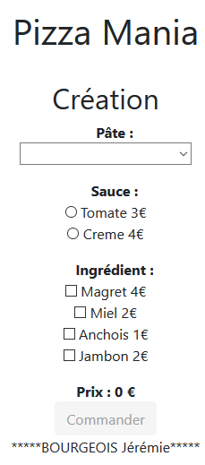

# Pizza Mania 

## Overview

This project is a Angular website released during my [APSIO professional Bachelor](https://www.iut-blagnac.fr/fr/formations/lp-apsio) for the Angular courses.

This webapp is a pizza ordering services which work with a embed local stored server.

Beside you can see some shots of the website...
### Accueil


### Pizza à la carte


### Composez vos propres pizza


## To run the webapp

### 1)
 Clone the entier PizzaMania folder somewhere at your disk root (or your user root)


### 2)
 Download and install Node.js with the folowing link : (https://nodejs.org/en/download/)


### 3)
 Install Angular at the project root folder (pizzamania-jeremieb) by the folowing bash command :  
```bash
npm install –g @angular/cli
```


### 4)
 Then, on the same repertory execute the command :
```bash
npm install --save-dev @angular-devkit/build-angular
```


### 5)
 After start the pizza ordering server services on the PizzaMania repertory with : 
```bash
java -jar server-2.jar
```


### 6)
 Finally start the website at the pizzamania-jeremieb folder withe the command : 
```bash
ng serve --open
```
**The website will be lauched with the default web browser and juste cliking on the "Accueil" link. Now enjoying !**

